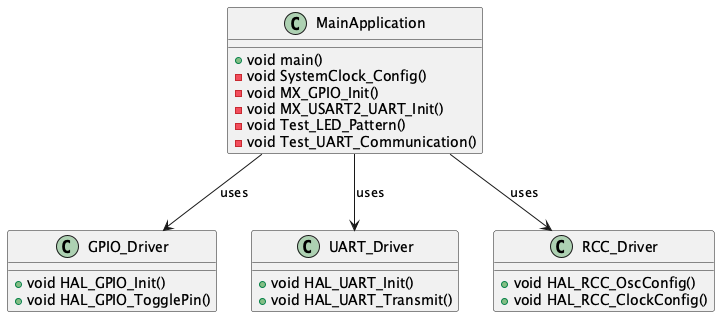

# STM32 Sample Project

This is a sample C++ project for STM32 microcontrollers. The project demonstrates basic functionality including:
- LED blinking
- UART communication
- Basic GPIO operations

## Project Structure
```
.
├── src/                    # Source files
│   ├── main.cpp           # Main application code
│   └── stm32f4xx_it.c     # Interrupt handlers
├── inc/                    # Header files
│   └── main.h             # Main header file
├── Drivers/               # STM32 HAL drivers
└── README.md             # This file
```

## UML Diagram


The UML diagram shows the structure of the project, including:
- Main application class with its methods
- HAL driver classes (GPIO, UART, RCC)
- Relationships between components

## Requirements
- STM32CubeIDE or similar development environment
- STM32F4xx microcontroller
- ST-Link programmer/debugger

## Building and Running
1. Open the project in STM32CubeIDE
2. Build the project
3. Connect your STM32 board
4. Flash the program using ST-Link

## Features
- LED blinking on GPIO pin
- UART communication at 115200 baud rate
- Basic error handling

//===

Great! You now have a working test application for your STM32 project. The application will:
-Blink the LED in a test pattern (5 quick blinks)
-Send test messages over UART
-Repeat the test cycle every 2 seconds

To run the application:
-Connect your STM32 board
-Flash the program using ST-Link
-Connect a serial terminal to see the UART messages
-Watch the LED for the blinking pattern