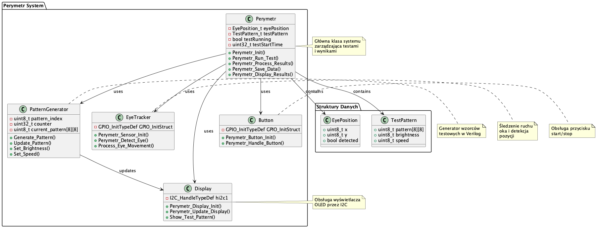

# Systemy Okulistyczne - STM32

## Opis Projektu
Zbiór projektów systemów okulistycznych opartych na mikrokontrolerze STM32F4. Projekt zawiera:

1. **Perymetr** - system testowy pola widzenia
   - Generowanie wzorców testowych w Verilog
   - Śledzenie ruchu oka
   - Wyświetlanie wyników

2. **Tonometr** - system pomiaru ciśnienia wewnątrzgałkowego
   - Pomiar ciśnienia
   - Kalibracja czujnika
   - Zapisywanie wyników

3. **Simple** - podstawowy projekt demonstracyjny
   - Test LED
   - Komunikacja UART
   - Podstawowe operacje GPIO

## Struktura Projektu
```
.
├── perymetr/       # Projekt perymetru
│   ├── inc/       # Pliki nagłówkowe
│   ├── src/       # Kod źródłowy
│   ├── verilog/   # Moduły Verilog
│   └── doc/       # Dokumentacja
│
├── tonometr/       # Projekt tonometru
│   ├── inc/       # Pliki nagłówkowe
│   ├── src/       # Kod źródłowy
│   └── doc/       # Dokumentacja
│
├── simple/         # Projekt podstawowy
│   ├── inc/       # Pliki nagłówkowe
│   ├── src/       # Kod źródłowy
│   └── doc/       # Dokumentacja
│
└── README.md      # Ten plik
```

## Wymagania Sprzętowe
- STM32F4 Nucleo
- Wyświetlacz OLED (I2C) - dla perymetru i tonometru
- Czujniki (ruch oka/ciśnienie) - dla perymetru i tonometru
- Przyciski start/stop - dla perymetru i tonometru
- LED na pinie PD12 - dla simple

## Wymagania Programowe
- PlatformIO
- Icarus Verilog (dla perymetru)
- STM32 HAL
- Biblioteki Adafruit (dla perymetru i tonometru)

## Instalacja
1. Sklonuj repozytorium
2. Zainstaluj PlatformIO:
```bash
brew install platformio
```
3. Zainstaluj Icarus Verilog (dla perymetru):
```bash
brew install icarus-verilog
```

## Kompilacja i Uruchomienie

### Perymetr
```bash
cd perymetr
pio run
```

### Tonometr
```bash
cd tonometr
pio run
```

### Simple
```bash
cd simple
pio run
```

## Diagramy UML

### Perymetr


### Tonometr


### Simple


## Funkcje Systemów

### Perymetr
1. Generowanie wzorców testowych:
   - 8 różnych wzorców
   - Kontrola jasności
   - Kontrola prędkości
   - Synchronizacja z STM32

2. Śledzenie ruchu oka:
   - Detekcja pozycji
   - Przetwarzanie danych
   - Zapisywanie wyników

### Tonometr
1. Pomiar ciśnienia:
   - Odczyt z czujnika
   - Kalibracja
   - Przetwarzanie danych
   - Zapisywanie wyników

2. Kalibracja:
   - Automatyczna kalibracja
   - Zapisywanie parametrów
   - Weryfikacja dokładności

### Simple
1. Test LED:
   - Miganie LED 5 razy
   - Opóźnienie 200ms między mignięciami
   - Powtarzanie co 2 sekundy

2. Komunikacja UART:
   - Prędkość 115200 baud
   - Wysyłanie komunikatów testowych
   - Monitorowanie stanu systemu

## Licencja
MIT License

## Autor
Grzegorz Skotniczny (zespol-it.pl)

## Kontakt
g.skotniczny@gmail.com