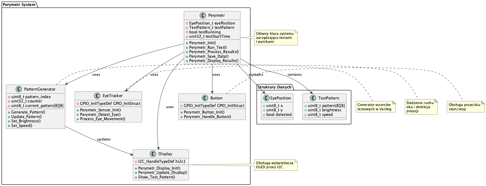

# Perymetr - System Testowy Wzroku

## Opis Projektu
System perymetru do testowania pola widzenia, wykorzystujący STM32F4 i moduł Verilog do generowania wzorców testowych. Projekt łączy w sobie:
- Mikrokontroler STM32F4
- Moduł Verilog do generowania wzorców
- Wyświetlacz OLED
- Czujnik ruchu oka

## Diagram UML


Diagram pokazuje główne komponenty systemu:
- Klasa Perymetr (zarządzanie testami)
- PatternGenerator (generator wzorców w Verilog)
- EyeTracker (śledzenie ruchu oka)
- Display (obsługa wyświetlacza)
- Button (obsługa przycisku)

## Struktura Projektu
```
perymetr/
├── inc/           # Pliki nagłówkowe
│   └── perymetr.h # Główny plik nagłówkowy
├── src/           # Kod źródłowy C++
│   └── main.cpp   # Główny plik źródłowy
├── verilog/       # Moduły Verilog
│   ├── pattern_generator.v    # Generator wzorców
│   └── pattern_generator_tb.v # Testy generatora
├── doc/           # Dokumentacja
│   └── uml/       # Diagramy UML
└── README.md      # Ten plik
```

## Wymagania Sprzętowe
- STM32F4 Nucleo
- Wyświetlacz OLED (I2C)
- Czujnik ruchu oka
- Przycisk start/stop

## Wymagania Programowe
- PlatformIO
- Icarus Verilog
- STM32 HAL
- Biblioteki Adafruit

## Instalacja
1. Sklonuj repozytorium
2. Zainstaluj PlatformIO:
```bash
brew install platformio
```
3. Zainstaluj Icarus Verilog:
```bash
brew install icarus-verilog
```

## Kompilacja i Uruchomienie

### Kompilacja STM32
```bash
cd perymetr
pio run
```

### Kompilacja i Testy Verilog
```bash
cd perymetr/verilog
iverilog -o test_pattern pattern_generator.v pattern_generator_tb.v
./test_pattern
```

## Funkcje Systemu
1. Generowanie wzorców testowych:
   - 8 różnych wzorców
   - Kontrola jasności
   - Kontrola prędkości
   - Synchronizacja z STM32

2. Śledzenie ruchu oka:
   - Detekcja pozycji
   - Przetwarzanie danych
   - Zapisywanie wyników

3. Interfejs użytkownika:
   - Wyświetlacz OLED
   - Przycisk start/stop
   - Komunikacja UART

## Przykład Użycia
```cpp
// Inicjalizacja systemu
Perymetr_Init();

// Uruchomienie testu
testRunning = true;
testStartTime = HAL_GetTick();

// Główna pętla
while (testRunning) {
    Perymetr_Run_Test();
    Perymetr_Update_Display();
}

// Przetwarzanie wyników
Perymetr_Process_Results();
Perymetr_Save_Data();
Perymetr_Display_Results();
```

## Testy Verilog
Moduł generatora wzorców zawiera testy:
1. Test inicjalizacji wzorców
2. Test zmiany jasności
3. Test zmiany prędkości
4. Test resetu

## Licencja
MIT License

## Autor
[Twoje Imię]

## Kontakt
[Twoje dane kontaktowe] 