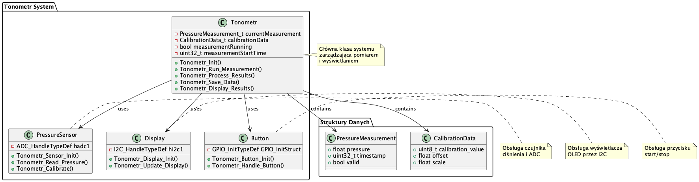

# Tonometr - System Pomiaru Ciśnienia Wewnątrzgałkowego

## Opis Projektu
System tonometru do pomiaru ciśnienia wewnątrzgałkowego, wykorzystujący STM32F4. Projekt zawiera:
- Mikrokontroler STM32F4
- Czujnik ciśnienia
- Wyświetlacz OLED
- Interfejs użytkownika

## Diagram UML


Diagram pokazuje główne komponenty systemu:
- Klasa Tonometr (zarządzanie pomiarem)
- PressureSensor (obsługa czujnika ciśnienia)
- Display (obsługa wyświetlacza)
- Button (obsługa przycisku)
- Struktury danych (PressureMeasurement, CalibrationData)

## Struktura Projektu
```
tonometr/
├── inc/           # Pliki nagłówkowe
│   └── tonometr.h # Główny plik nagłówkowy
├── src/           # Kod źródłowy C++
│   └── main.cpp   # Główny plik źródłowy
├── doc/           # Dokumentacja
│   └── uml/       # Diagramy UML
└── README.md      # Ten plik
```

## Wymagania Sprzętowe
- STM32F4 Nucleo
- Wyświetlacz OLED (I2C)
- Czujnik ciśnienia
- Przycisk start/stop

## Wymagania Programowe
- PlatformIO
- STM32 HAL
- Biblioteki Adafruit

## Instalacja
1. Sklonuj repozytorium
2. Zainstaluj PlatformIO:
```bash
brew install platformio
```

## Kompilacja i Uruchomienie
```bash
cd tonometr
pio run
```

## Funkcje Systemu
1. Pomiar ciśnienia:
   - Odczyt z czujnika
   - Kalibracja
   - Przetwarzanie danych
   - Zapisywanie wyników

2. Interfejs użytkownika:
   - Wyświetlacz OLED
   - Przycisk start/stop
   - Komunikacja UART

3. Kalibracja:
   - Automatyczna kalibracja
   - Zapisywanie parametrów
   - Weryfikacja dokładności

## Przykład Użycia
```cpp
// Inicjalizacja systemu
Tonometr_Init();

// Uruchomienie pomiaru
measurementRunning = true;
measurementStartTime = HAL_GetTick();

// Główna pętla
while (measurementRunning) {
    Tonometr_Run_Measurement();
    Tonometr_Update_Display();
}

// Przetwarzanie wyników
Tonometr_Process_Results();
Tonometr_Save_Data();
Tonometr_Display_Results();
```

## Licencja
MIT License

## Autor
[Twoje Imię]

## Kontakt
[Twoje dane kontaktowe] 